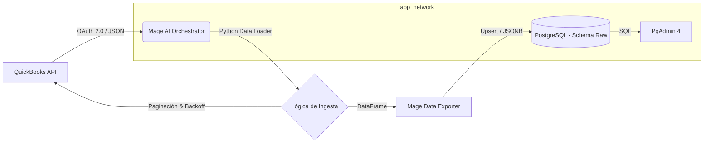

# Proyecto ETL: Ingesta de QuickBooks Online a PostgreSQL

Este proyecto implementa una arquitectura de datos moderna para realizar un **Backfill Histórico** de entidades financieras (Customers, Invoices, Items) desde el Sandbox de **QuickBooks Online (QBO)** hacia una base de datos **PostgreSQL** en capa **Raw**.

La solución está orquestada con **Mage AI**, containerizada con **Docker**, y diseñada bajo principios de **idempotencia**, **manejo robusto de errores** y **gestión controlada de secretos**.

---

## 1. Descripción y Arquitectura

El flujo de datos sigue un proceso **ETL (Extract, Load)** sin transformaciones complejas, depositando la data cruda para auditoría, trazabilidad y futuras transformaciones downstream.

### Diagrama de Arquitectura



### Componentes

1. **Origen (Source):** QuickBooks Online API (Sandbox). Extracción mediante consultas `SELECT *` por entidad.
2. **Orquestador (Mage AI):** Ejecuta pipelines independientes, gestiona autenticación OAuth 2.0 (renovación automática de tokens), segmentación temporal (chunking diario) y control de rate limits.
3. **Destino (Target):** PostgreSQL 13. Persistencia en formato `JSONB` dentro del esquema `raw`.
4. **Infraestructura:** Servicios aislados y comunicados mediante una red Docker privada (`app_network`).

---

## 2. Despliegue y Configuración

### Prerrequisitos

* Docker y Docker Compose instalados.
* Credenciales válidas de QuickBooks Sandbox (Client ID, Client Secret, Refresh Token).

### Pasos para levantar el proyecto

1. **Clonar el repositorio**

```bash
git clone <URL_DEL_REPO>
cd <CARPETA_DEL_PROYECTO>
```

2. **Iniciar los contenedores**

```bash
docker compose up -d
```

Esto iniciará los servicios `mage`, `postgres` y `pgadmin`.

3. **Acceso a las interfaces**

* **Mage AI:** [http://localhost:6789](http://localhost:6789)
* **PgAdmin:** [http://localhost:8085](http://localhost:8085)

  * Email: `admin@admin.com`
  * Password: `admin`

---

## 3. Gestión de Secretos

> ⚠️ **Nota de seguridad (excepción académica)**
> Para cumplir con el requisito de evaluación de permitir la ejecución inmediata vía `docker compose up`, las credenciales de Sandbox se centralizan en el archivo `io_config.yaml`.
>
> **En un entorno productivo**, este archivo estaría excluido del repositorio (`.gitignore`) y los secretos se inyectarían mediante un **Secret Manager** o variables de entorno, cumpliendo el principio de *no secrets in code*.

### Inventario de Secretos

| Variable            | Propósito                       | Política de rotación                      | Responsable    |
| ------------------- | ------------------------------- | ----------------------------------------- | -------------- |
| `QBO_CLIENT_ID`     | Identificador de la app Sandbox | Anual o ante compromiso                   | DevOps / Owner |
| `QBO_CLIENT_SECRET` | Secreto OAuth 2.0               | Anual o ante compromiso                   | DevOps / Owner |
| `QBO_REFRESH_TOKEN` | Generación de access tokens     | **Crítico** (24h Sandbox / 100 días Prod) | Data Engineer  |
| `QBO_REALM_ID`      | ID de la compañía (tenant)      | Fijo                                      | Data Engineer  |
| `POSTGRES_USER`     | Usuario propietario de la DB    | Solo ante incidentes                      | DBA            |
| `POSTGRES_PASSWORD` | Password de la DB               | Solo ante incidentes                      | DBA            |

---

## 4. Detalle de Pipelines (Backfill Histórico)

Se implementan tres pipelines independientes, con lógica idéntica y segregación por entidad:

1. `qb_customers_backfill`
2. `qb_invoices_backfill`
3. `qb_items_backfill`

### Parámetros y Lógica

**Parámetros de ejecución**

* `fecha_inicio` (YYYY-MM-DD)
* `fecha_fin` (YYYY-MM-DD)

**Segmentación temporal (chunking)**

* Iteración día a día (`timedelta(days=1)`), reduciendo timeouts y permitiendo reanudación ante fallos parciales.

**Paginación y límites**

* `MAXRESULTS = 1000` registros por página.
* El loop continúa hasta que `len(batch) < 1000`.

**Política de reintentos (backoff exponencial)**

* Manejo de errores HTTP 429 y 5xx.
* Fórmula: `time.sleep(2 ** attempt)`.
* Máximo 5 intentos por día antes de marcar fallo.

### Runbook (Ejecución manual)

1. Verificar vigencia del `QBO_REFRESH_TOKEN` en `io_config.yaml`.
2. Acceder a Mage → Pipeline → Triggers.
3. Definir `fecha_inicio` y `fecha_fin` como *Runtime variables*.
4. Ejecutar **Run Now**.

---

## 5. Trigger One-Time

Los pipelines están configurados para **ejecución única bajo demanda**.

* **Zona horaria:** QBO opera estrictamente en **UTC**.
* **Equivalencia:** 12:00 UTC = 07:00 AM Guayaquil (UTC-5).

**Política de deshabilitación**

* Una vez completado el backfill histórico (status *Success*), el trigger debe marcarse manualmente como **INACTIVE** para prevenir ejecuciones accidentales.

---

## 6. Esquema Raw (PostgreSQL)

Los datos se almacenan sin transformación en el esquema `raw`.

### Tablas

* `raw.qb_customers`
* `raw.qb_invoices`
* `raw.qb_items`

| Columna                    | Tipo      | Descripción                         |
| -------------------------- | --------- | ----------------------------------- |
| `id`                       | VARCHAR   | **PK** – ID original de QBO         |
| `payload`                  | JSONB     | Objeto completo devuelto por la API |
| `ingested_at_utc`          | TIMESTAMP | Auditoría de ingesta                |
| `extract_window_start_utc` | VARCHAR   | Inicio del rango de extracción      |
| `extract_window_end_utc`   | VARCHAR   | Fin del rango de extracción         |
| `page_number`              | INTEGER   | Página de origen en la API          |

### Idempotencia

La carga utiliza:

```sql
INSERT ... ON CONFLICT (id) DO UPDATE
```

Esto garantiza que las reejecuciones actualicen registros existentes sin generar duplicados.

---

## 7. Validaciones y Volumetría

### Conteo de registros

```sql
SELECT 'Customers' AS entidad, COUNT(*) FROM raw.qb_customers
UNION ALL
SELECT 'Invoices', COUNT(*) FROM raw.qb_invoices
UNION ALL
SELECT 'Items', COUNT(*) FROM raw.qb_items;
```

El resultado debe ser consistente con el Sandbox de QuickBooks.

### Validación de duplicados (idempotencia)

```sql
SELECT id, COUNT(*)
FROM raw.qb_customers
GROUP BY id
HAVING COUNT(*) > 1;
```

El resultado esperado es **vacío**.

---

## 8. Troubleshooting (Solución de Problemas)

Esta sección cubre los escenarios de fallo comunes relacionados con autenticación, ingesta y persistencia.

| Categoría | Síntoma / Error | Causa Probable | Solución |
| :--- | :--- | :--- | :--- |
| **Auth** | `401 - Invalid Grant` o `Auth Failed` | El **Refresh Token** de Sandbox ha expirado (duración 24h) o fue invalidado. | 1. Ir a Intuit Playground.<br>2. Generar nuevos tokens.<br>3. Actualizar `io_config.yaml` y reiniciar. |
| **Paginación** | El pipeline se queda corriendo indefinidamente o trae menos datos. | Error en la lógica de `MAXRESULTS` o bucle `while`. | El sistema verifica `len(batch) < 1000`. Revisar logs para ver `page_number`. Si un día tiene >50k registros, reducir el rango de fechas. |
| **Límites** | `429 - Too Many Requests` | Exceso de peticiones a la API de QBO (Rate Limit). | El código implementa **Backoff Exponencial** (espera progresiva). Revisar logs para confirmar: *"Rate Limit detected, sleeping..."*. |
| **Timezones** | Faltan datos del día actual o hay discrepancia de horas. | Confusión entre UTC y Hora Local (Ecuador). | **Solución:** QBO opera estrictamente en **UTC**. Si son las 19:00 en Ecuador (00:00 UTC del día siguiente), los datos pertenecen a mañana en QBO. **Siempre filtrar usando UTC.** |
| **Almacenamiento** | Los datos desaparecen al hacer `docker compose down`. | Volumen de Docker no montado correctamente. | Verificar en `docker-compose.yml` que `volumes: - db-data:/var/lib/postgresql/data` esté activo y la carpeta exista. |
| **Permisos** | `FATAL: password authentication failed` o `Permission denied`. | Credenciales incorrectas en `io_config` o usuario sin permisos de escritura. | 1. Verificar `POSTGRES_PASSWORD` en `io_config.yaml`.<br>2. Asegurar que el usuario `postgres_user` sea dueño de la DB `postgres_db`. |

---

## 9. Estructura del Proyecto

```text
├── pipelines/             # Pipelines Mage
├── data_loaders/          # Extracción desde QBO
├── data_exporters/        # Carga a PostgreSQL
├── sql/
│   └── init_db.sql        # Creación esquema RAW
├── evidencias/            # Evidencias académicas
├── io_config.yaml         # Configuración y secretos (Sandbox)
├── docker-compose.yml     # Orquestación Docker
└── README.md              # Documentación
```

---

## 10. Checklist de Aceptación

* [x] Comunicación Mage ↔ Postgres por nombre de servicio
* [x] Secretos centralizados en Mage (io_config)
* [x] Pipelines parametrizables por rango UTC
* [x] Segmentación diaria y paginación controlada
* [x] Trigger one-time ejecutado y deshabilitado
* [x] Esquema raw con payload completo y metadatos
* [x] Idempotencia validada (sin duplicados)
* [x] Rate limits y reintentos documentados
* [x] Volumetría y validaciones registradas
